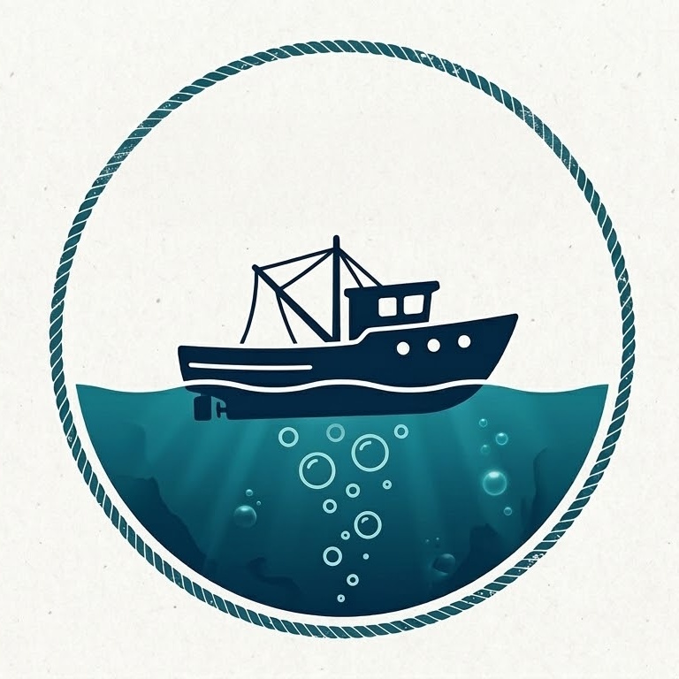

# Debt to the Deep

A 4-player cooperative horror fishing game where you and your crew must catch enough fish to satisfy a hungry shark lurking in the depths. Meet your daily quota or face the consequences.

## 🎮 Game Overview

**Debt to the Deep** is a multiplayer co-op fishing adventure with horror elements. Players work together on a boat, taking on specialized roles to catch fish, navigate treacherous waters, and survive the ocean's terrors. Fail to meet your daily fish quota, and the shark will collect its debt in blood.

## ✨ Key Features

### Multiplayer Co-op
- **4-Player Support**: Team up with up to 3 friends
- **Proximity Voice Chat**: Communicate with nearby crew members
- **Role-Based Gameplay**: Each player contributes unique abilities

### Player Roles

#### 🧭 Navigator
- Drive the boat through dangerous waters
- Use the map to locate fishing spots
- Track weather conditions
- Spot jumping fish from a distance

#### 🎣 Fisher
- Master the art of fishing from the boat
- Choose from 10 different fishing rods
- Use various bait types to attract different fish
- Catch diverse fish species

#### 🔧 Mechanic
- Repair boat damage
- Maintain the engine and systems
- Keep the crew afloat during emergencies

#### 🤿 Diver (Unlockable)
- Unlock with earned credits
- Dive underwater for treasure
- Hunt for rare deep-sea fish
- Explore the ocean floor

### Gameplay Systems

#### Fishing & Collection
- **Multiple Fish Types**: Catch various species with different behaviors
- **10 Fishing Rods**: Upgrade your equipment for better catches
- **Bait System**: Strategic bait choice affects your success
- **Daily Quota**: Meet the shark's demands or face consequences

#### Boat Management
- **Upgradeable Boat**: Improve your vessel over time
- **Damage System**: Boat takes damage and requires repairs
- **Navigation**: Traverse 5 unique map environments

#### Progression & Economy
- **Harbor Safe Zone**: Return to safety to sell fish and restock
- **Equipment Shop**: Purchase better fishing rods and bait
- **Character Customization**: Unlock cosmetic loot from fishing
- **Credit System**: Earn money to unlock roles and upgrades

### World & Environment
- **5 Unique Maps**: Each with distinct features and challenges
- **Dynamic Weather**: Conditions affect gameplay and danger
- **Horror Atmosphere**: Face the terror of the deep

## 🔧 Technical Details

- **Engine**: Godot 4.6
- **Graphics**: 3D with Forward+ rendering
- **Physics**: Jolt Physics Engine
- **Platform**: Windows (D3D12 renderer)

## 🚀 Getting Started

### Prerequisites
- Godot Engine 4.6 or later
- Windows OS (for D3D12 support)

### Running the Game
1. Open the project in Godot Engine 4.6
2. Press F5 or click "Play" to run the game
3. For multiplayer, configure network settings in-game

### Development
- Edit scenes and scripts using the Godot Editor
- Test multiplayer locally or across LAN
- Proximity voice chat requires microphone permissions

## 🎯 Development Status

This project is currently in development. Core features implemented:
- ✅ Project structure and configuration
- ✅ Game concept and design documentation
- 🚧 Player roles and mechanics (In Progress)
- 🚧 Fishing system (In Progress)
- 🚧 Multiplayer networking (In Progress)
- 📋 Maps and environments (Planned)
- 📋 Progression system (Planned)

## 🎮 How to Play

1. **Form Your Crew**: Gather up to 4 players
2. **Choose Your Role**: Select Navigator, Fisher, Mechanic, or Diver (if unlocked)
3. **Set Sail**: Navigate to fishing spots on the map
4. **Catch Fish**: Work together to meet the daily quota
5. **Return to Harbor**: Sell your catch and upgrade your equipment
6. **Survive**: Don't let the shark catch you short on fish

## 🗺️ Roadmap

### Current Focus
- Implement core fishing mechanics
- Develop multiplayer networking
- Create first playable map
- Build boat control system

### Future Features
- Additional maps and environments
- More fish varieties
- Advanced boat upgrades
- Enhanced horror elements
- Additional sea creatures
- Night fishing missions
- Legendary fish encounters

## 📝 Credits

**Debt to the Deep** - A cooperative horror fishing experience

## 📄 License

This project is currently in development. License information to be determined.

---

*"The sea demands payment. Will you meet your debt, or become part of it?"*
